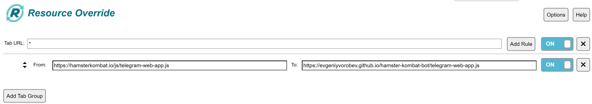

# Introducing project
At first, this project enables launching MuskEmpire bot on PC Browser by making browser use a modified web-app using an extention called Resource Override
Second, using a sloppy python script I wrote, we manage to check for the best possible purchase with highest profit value available to you, then make the purchase and collect your money every 30 seconds.

# Enabling game on PC Browser
1. Install the Resource Override extention on your browser ([Chrome](https://chromewebstore.google.com/detail/resource-override/pkoacgokdfckfpndoffpifphamojphii))
2. Open the extension settings and enter the following data:
3. Tab URL: `*` From: `https://telegram.org/js/telegram-web-app.js` To: `https://evgeniyvorobev.github.io/hamster-kombat-bot/telegram-web-app.js`
4. 
5. Open [Bot MuskEmpire](https://web.telegram.org/k/#?tgaddr=tg%3A%2F%2Fresolve%3Fdomain%3Dmuskempire_bot%26appname%3Dgame%26startapp%3Dhero521693536) and run the game
## 
