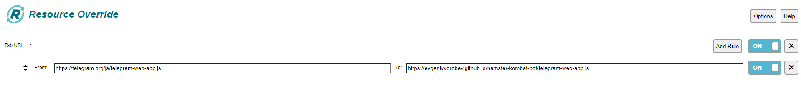
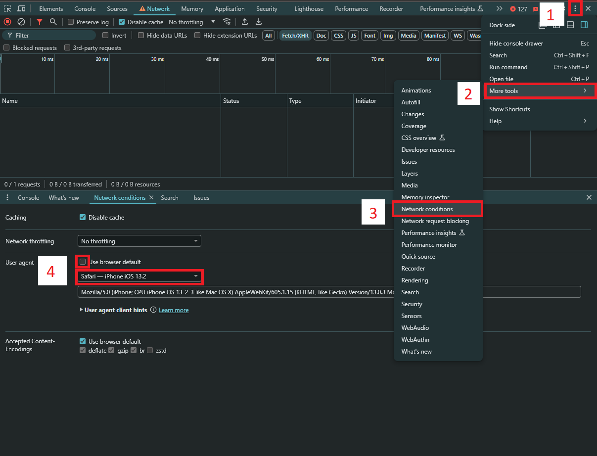
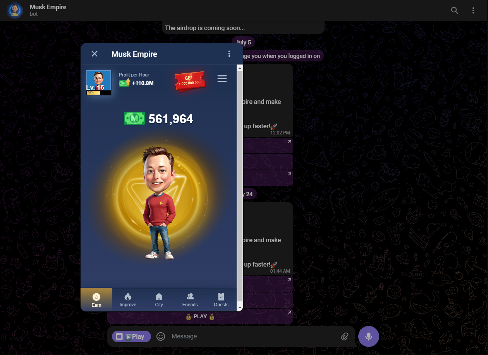
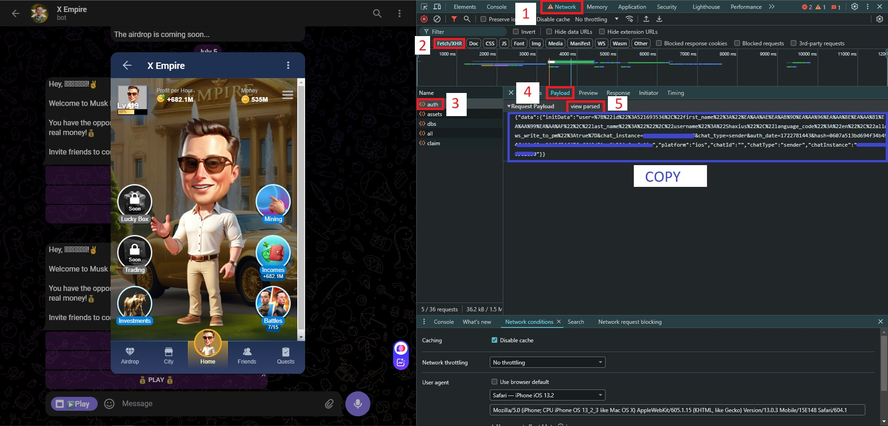

# Introducing project
At first, this project enables launching MuskEmpire bot on PC Browser by making browser use a modified web-app using an extention called Resource Override
Second, using a sloppy python script I wrote, we manage to check for the best possible purchase with highest profit value available to you, then make the purchase and collect your money every 60 seconds.


| Feature  | Supported |
| ---      | ---       |
| Auto claim offline bonus  |  ✅  |
| Auto collect money every minute  |  ✅  |
| Calculate and purchace best skill  |  ✅  |
| Playable game through PC Browser  |  ✅  |
| Friendly coded for python newbies  |  ✅  |

# Enabling game on PC Browser
## Installing Extention
1. Install the Resource Override extention on your browser ([Chrome](https://chromewebstore.google.com/detail/resource-override/pkoacgokdfckfpndoffpifphamojphii))
2. Open the extension settings and enter the following data:
3. Tab URL: `*` From: `https://telegram.org/js/telegram-web-app.js` To: `https://ashaxer.github.io/MuskEmpire_autobuy/telegram-web-app.js`


## Changing User-Agent
Open the DevTools tab on the browser (You can press Ctrl+Shift+C shortcut to open this tab)

1. Click on the three-dot menu
2. Hover on "More Tools"
3. Click on "Network Conditions"
4. Uncheck the "Use browser default" and set the agent as "Safari - iPhone iOS 13.2"
Open [Bot MuskEmpire](https://web.telegram.org/k/#?tgaddr=tg%3A%2F%2Fresolve%3Fdomain%3Dmuskempire_bot%26appname%3Dgame%26startapp%3Dhero521693536) and run the game


# Running the auto buy script
To run the script we must copy the payload of auth request in source view mode from browser. to achieve this follow the below steps:
## Finding auth payload value
Open the DevTools tab on the browser (You can press Ctrl+Shift+C shortcut to open this tab)

1. Switch to "Network" tab
2. For better result, filter the requests by clicking on "Fetch/XHR"
3. Find  the "auth" request and click on it
4. Switch to "Payload" of request details
5. Click on "view source" to change view mode
6. Select all the payload value (Thriple-Click) and Copy it

## Downloading and running the python scripts
You can use this bot on any machine supporting python
(Make sure you have reqired packages)
just make a folder, download the files into it, run the script and paste the Payload  you got earlier
(Note: Try not using old Payload values for this script, Use newly generated Payload from [last step](https://github.com/Ashaxer/MuskEmpire_autobuy/blob/main/README.md#finding-auth-payload-value) each time to prevent from getting banned)

Linux:
```bash
cd && mkdir MuskEmpireAuto && cd MuskEmpireAuto
curl -O https://raw.githubusercontent.com/Ashaxer/MuskEmpire_autobuy/main/ElonAutoBuy.py
pip3 install humanize
python3 ElonAutoBuy.py
```
